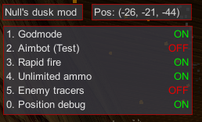
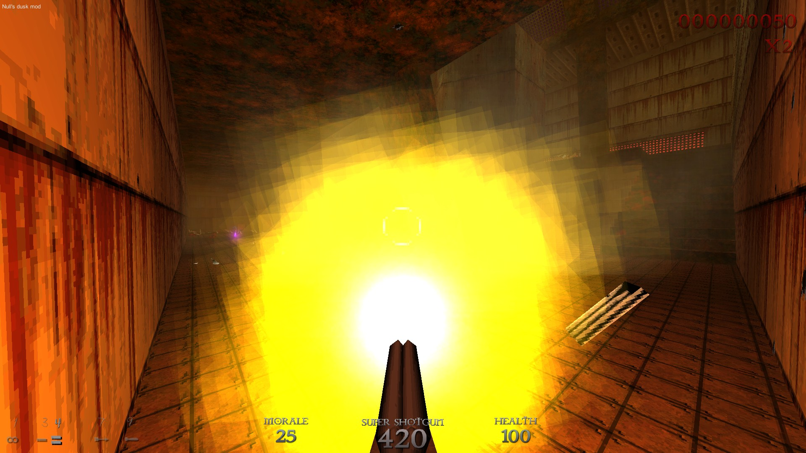
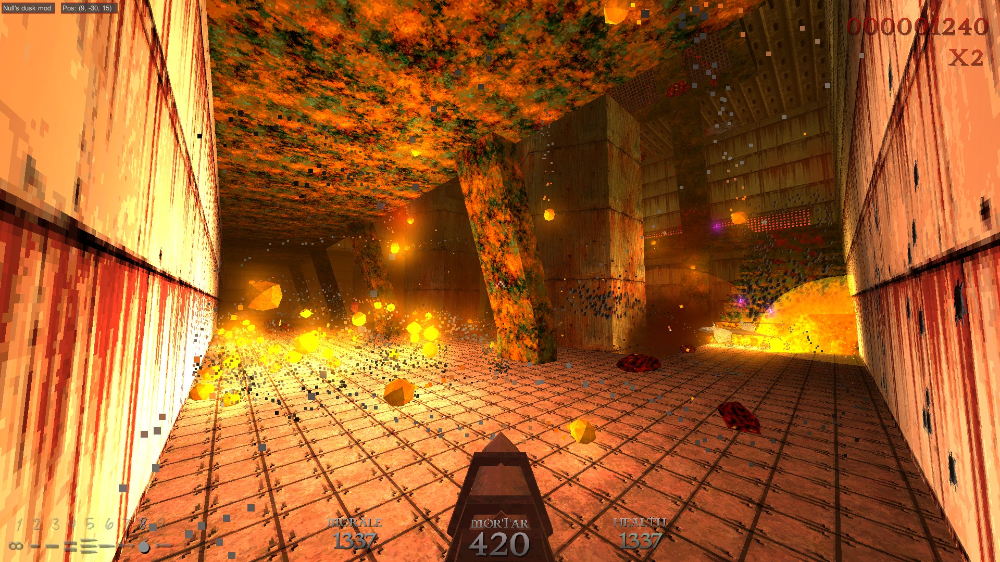
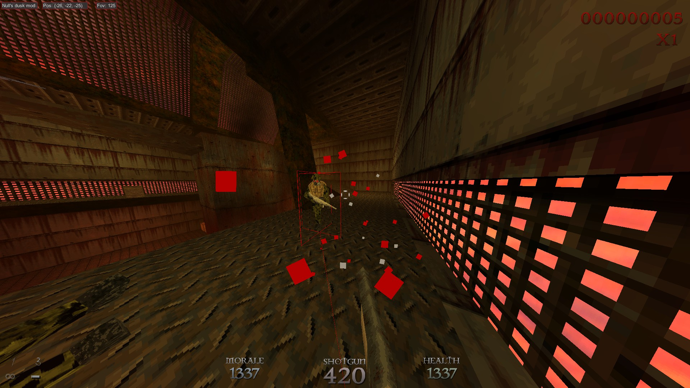

# DuskHaxx
**A useless mod for singleplayer dusk.**

Did it because I was bored.

Based on [CometVTwo](https://github.com/TheReal3rd/CometVTwo).

### Features
- Godmode.
- Aimbot.
- Rapid fire.
- Unlimited ammo.
- Enemy ESP (tracers, base and 3d box).
- NoClip.
- Debug player position.
- Debug player fov.
- Console (See todo).

### How to use
- Hold `Insert` to bring mouse and show the menu (depending on the settings).
- `Insert` + `Number` to toggle options.
- `Insert` + `k` to toggle console (See todo).
- Hold `Mouse4` / `Mouse2` to aimbot (if the option is toggled).
- `V` to toggle noclip (if the option is toggled).
- `Delete` to exit.

### Console commands (See todo)
- `kill`: Suicide
- `set_fov [float]`: Change CAMERA fov. Useful for tracers and shit.
- `set_timescale [float]`: Change timescale.
- `tp [x] [y] [z]`: Teleport player to Vector3. Y is the height.

### How to inject
Use a monoinjector like [SharpMonoInjector](https://github.com/warbler/SharpMonoInjector).

Setting      | Name
-------------|----------------
Namespace    | `DuskHaxx`
Class name   | `Loader`
Method name  | `Init`

### Screenshots

### Todo
- ~~Fix tracer fov.~~
- ~~Change movement direction with the aimbot.~~
- Make console detect Enter / Escape when typing in the TextField.
- Draw dusk's cursor on top of the menu?
- Clickable menu.
