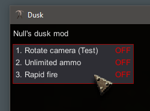

# DuskHaxx
**A useless mod for singleplayer dusk.**

Did it because I was bored.

### Features
- Rotate camera (Just a `myMouseLook` test)
- Unlimited ammo
- Rapid fire

### How to use
- Hold `Insert` to bring mouse and show the menu (depending on the settings).
- `Insert` + `Number` to toggle options.
- `Delete` to exit.

### How to inject
Use a monoinjector like [SharpMonoInjector](https://github.com/warbler/SharpMonoInjector).

Setting      | Name
-------------|----------------
Namespace    | `DuskHaxx`
Class name   | `Loader`
Method name  | `Init`

### Screenshots

